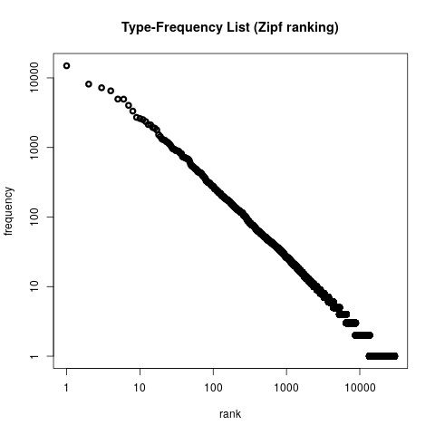
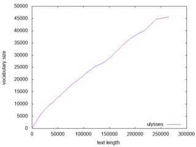
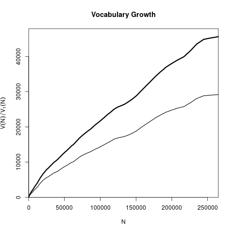
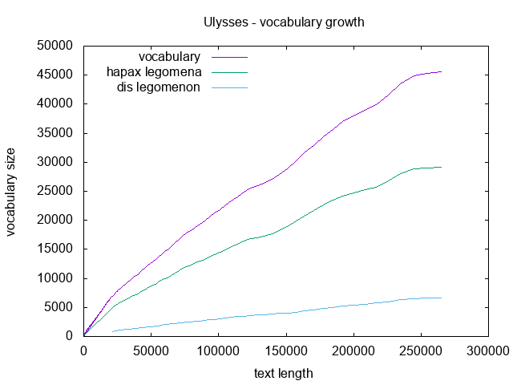

# clscripts
Repository for computational linguistics scripts (bash, python, octave, etc).


# Table of Contents
1. [wordcounttfl.sh](#wordcounttfl)
2. [entropy.py](#pyentropy)
3. [heapslaw.py](#heapslaw)
4. [vgc.py](#vgc)

## wordcounttfl.sh <a name="wordcounttfl"></a>
Count the occurrence of words in a text file (or from stdin) and output a list of frequency and types (words) complatible with zipfR frequency spectrum file.

### usage examples
The examples bellow will count the ocurrences of words in ulysses.txt and output the result to the standard output:
```
$./wordcounttfl.sh ulysses.txt 
$./wordcounttfl.sh -i ulysses.txt
$./wordcounttfl.sh --input-file ulysses.txt
$cat ulysses.txt | ./wordcounttfl.sh 
```
Any of them will give the same result:
```
  f     type
  14952 the
  8141  of
  7217  and
  6521  a
  4963  to
  4946  in
  4032  he
  3333  his
  2708  i
    ...
```

If you want to save the result in a file, you may simply redirect it to the desired file:
```
$./wordcounttfl.sh ulysses.txt > ulysses.tfl
```
or you may specify it as an argument to the script:
```
$./wordcounttfl.sh -i ulysses.txt -o ulysses.tfl
$./wordcounttfl.sh --input-file ulysses.txt --output-file ulysses.tfl
```

It is possible to output only the count values as exemplified bellow:
```
./wordcounttfl.sh -i ulysses.txt -c -o ulysses.cnt
./wordcounttfl.sh ---input-file ulysses.txt --output-file ulysses.cnt --counts
```

Using the frequency spectrum file with zipfR:
```
> library(zipfR)
> ulysses = read.tfl('ulysses.tfl')
> summary(ulysses)
zipfR object for frequency spectrum
Sample size:     N  = 264625 
Vocabulary size: V  = 29743 
Range of freq's: f  = 1 ... 14952 
Mean / median:   mu = 8.897051 ,  M = 1 
Hapaxes etc.:    V1 = 16199 ,  V2 = 4788 
Types:    a aaron aback abaft abandon ...
> png('ulysses_f.png')
> plot(ulysses, log="xy")
> dev.off()
```



## entropy.py <a name="pyentropy"></a>
Compute an estimate for the Shannon entropy given a vector of counts in a input file or through the stdin. As default, the entropy is calculated in bits, but you might specify the desired base as well. The entropy might estimated using the following approaches: maximum likelihood estimate (using the plug-in formula, used as the default approach), jackknife resampling technique or Miller-Madow correction to the plug-in estimate. For each of them you must provide a string with the method name: 'mle' or 'plugin', jk' or 'jackknife' and 'mm' or 'millermadow', respectivelly.

### usage examples
A simple example to compute the word counts from the text Ulysses and use the maximum likelihood estimate to estimate the entropy in bits.

```
$ cat ulysses.txt | ./wordcounttfl.sh -c | ./entropy.py
$ ./wordcounttfl.sh -c -i ulysses.txt | ./entropy.py
$ ./wordcounttfl.sh -c -i ulysses.txt -o ulysses.cnt && ./entropy.py -i ulysses.cnt 
$ ./wordcounttfl.sh -c -i ulysses.txt | ./entropy.py --method mm
$ ./wordcounttfl.sh -c -i ulysses.txt -o ulysses.cnt && ./entropy.py -i ulysses.cnt --method mm
```

## heapslaw.py <a name="heapslaw"></a>
Extract vocabulary size from different lengths of a text file, suitable to check Heaps' (or Heardan's) law.

### parameters
* **-i**: input file name
* **--maxlen**: maximum length of the text that will be considered (default: full length)
* **--samples**: number of samples that will be created (default: 100)
* **--log**: if provided, the genenerated samples will be logarithmically spaced


### usage examples
Given only the input file name, it will compute 100 linear spaced samples of the vocabulary growth. The first colum represents the text length and the second the vocabulary size.
```
./heapslaw.py -i Ulysses.txt
```

```
1       1
2677    1203
5354    2038
8030    2908
10707   3704
13383   4526
16059   5466
18736   6260
 ...     ...
256936  45340
259612  45420
262289  45495
264965  45599
```

We might also splicity specify other parameters:
```
./heapslaw.py -i Ulysses.txt --maxlen 264965 --samples 100
```
The example above will produce the same result, since the parameters given are the default values. 

Using **heapslaw.py** along with **gnuplot** to produce a vocabulary growth curve:
```
./heapslaw.py -i ulysses.txt | gnuplot -e "set terminal png; set output 'ulysses.png'; set xlabel 'text length'; set ylabel 'vocabulary size'; set key right bottom; plot '/dev/stdin' with lines title 'ulysses'" 
```



## vgc.py <a name="vgc"></a>
Create vocabulary growth curve data, compatible with zipfR package. Like **heaps.py**, lets provides the first column with text length, the second with vocabulary size and the subsequent columns display the number of types appearing from 1 to N times, where N is given by the **-V** parameter.

### parameters
* **-i**: input file name
* **--maxlen**: maximum length of the text that will be considered (default: full length)
* **--samples**: number of samples that will be created (default: 100)
* **--log**: if provided, the genenerated samples will be logarithmically spaced
* **-V**: number of frequencies we are interested in, **-V 1** will display also the *hapax legomena*, **-V 2** will display *hapax legomena* and *dis legomenon*, and so forth.

### usage examples
For the basic usage, you just need to provide the text file.
```
/vgc.py -i ulysses.txt
```
The result will be:
```
N       V       V1 
1       1       1 
2677    1203    892 
5354    2038    1462 
8030    2908    2096 
10707   3704    2656 
13383   4526    3250 
16059   5466    3981 
  ...    ...     ...
259612  45420   29082 
262289  45495   29117 
264965  45599   29168 
```

You can also read text from stdin.
```
cat ulysses.txt | ./vgc.py --maxlen 10 -V 3
```

The result is:t
```
N   V   V1  V2  V3 
1   1   1   0   0 
2   2   2   0   0 
3   3   3   0   0 
4   4   4   0   0 
5   5   5   0   0 
6   6   6   0   0 
7   6   5   1   0 
8   7   6   1   0 
9   8   7   1   0 
10  9   8   1   0 
```

```
$ ./vgc.py -i ulysses.txt --samples 256 --log -V 3 > ulysses.vgc
$ R
> uvgc = read.vgc('ulysses.vgc')
> png('ulysses_vgc.png')
> plot(uvgc, add.m=1)
> dev.off()
```


Or it might be done directly on shell using **gnuplot**:
```
./vgc.py -i ulysses.txt --samples 256 --log -V 3 -c | awk -- '{print $0} END{print "e"}' | tee -i -a /dev/stdout /dev/stdout | gnuplot -e "set terminal png; set output 'ulysses_vgc2.png'; set xlabel 'text length'; set ylabel 'vocabulary size'; set title 'Ulysses - vocabulary growth'; set key left top; plot '-' using 1:2 with lines title 'vocabulary', '-' using 1:3 with lines title 'hapax legomena', '-' using 1:4 with lines title 'dis legomenon'"
```
**awk** is used to add an *e* to the end and **tee** is used to replicte the *stdout* since **gnuplot** needs one data for each line.


