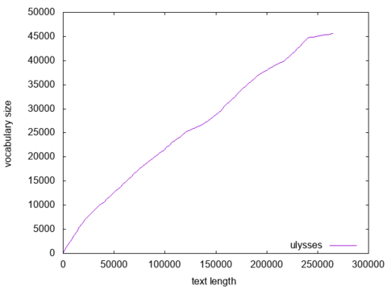

# clscripts
Repository for computational linguistics scripts (bash, python, octave, etc).


# Table of Contents
1. [wordcounttfl.sh](#wordcounttfl)
2. [entropy.py](#pyentropy)
3. [heapslaw.py](#heapslaw)
4. [vgc.py](#vgc)
5. [wordslengthdist.sh](#wordslengthdist)
6. [surroundingcontext.sh](#surroundingcontext)
7. [wordposition.sh](#wordposition)
8. [wordchart.sh](#wordchart)
9. [simons.py](#simons)
10. [swnwdensity.sh](#swnwdensity)

## wordcounttfl.sh <a name="wordcounttfl"></a>
Count the occurrence of words in a text file (or from stdin) and output a list of frequency and types (words) compatible with zipfR frequency spectrum file.

### usage examples
The examples bellow will count the occurrences of words in ulysses.txt and output the result to the standard output:
```
$./wordcounttfl.sh ulysses.txt 
$./wordcounttfl.sh -i ulysses.txt
$./wordcounttfl.sh --input-file ulysses.txt
$cat ulysses.txt | ./wordcounttfl.sh 
```
Any of them will give the same result:
```
  f     type
  14952 the
  8141  of
  7217  and
  6521  a
  4963  to
  4946  in
  4032  he
  3333  his
  2708  i
    ...
```

If you want to save the result in a file, you may simply redirect it to the desired file:
```
$./wordcounttfl.sh ulysses.txt > ulysses.tfl
```
or you may specify it as an argument to the script:
```
$./wordcounttfl.sh -i ulysses.txt -o ulysses.tfl
$./wordcounttfl.sh --input-file ulysses.txt --output-file ulysses.tfl
```

It is possible to output only the count values as exemplified bellow:
```
./wordcounttfl.sh -i ulysses.txt -c -o ulysses.cnt
./wordcounttfl.sh ---input-file ulysses.txt --output-file ulysses.cnt --counts
```

Using the frequency spectrum file with zipfR:
```
> library(zipfR)
> ulysses = read.tfl('ulysses.tfl')
> summary(ulysses)
zipfR object for frequency spectrum
Sample size:     N  = 264625 
Vocabulary size: V  = 29743 
Range of freq's: f  = 1 ... 14952 
Mean / median:   mu = 8.897051 ,  M = 1 
Hapaxes etc.:    V1 = 16199 ,  V2 = 4788 
Types:    a aaron aback abaft abandon ...
> png('ulysses_f.png')
> plot(ulysses, log="xy")
> dev.off()
```


You may also get the frequency counts for multiple files in parallel using GNU Parallel as shown below:
```
$ ls *.txt | parallel 'cat {} | ./wordcounttfl.sh > {.}.flt'
```


## entropy.py <a name="pyentropy"></a>
Compute an estimate for the Shannon entropy given a vector of counts in a input file or through the stdin. As default, the entropy is calculated in bits, but you might specify the desired base as well. The entropy might estimated using the following approaches: maximum likelihood estimate (using the plug-in formula, used as the default approach), jackknife resampling technique or Miller-Madow correction to the plug-in estimate. For each of them you must provide a string with the method name: 'mle' or 'plugin', jk' or 'jackknife' and 'mm' or 'millermadow', respectively.

### usage examples
A simple example to compute the word counts from the text Ulysses and use the maximum likelihood estimate to estimate the entropy in bits.

```
$ cat ulysses.txt | ./wordcounttfl.sh -c | ./entropy.py
$ ./wordcounttfl.sh -c -i ulysses.txt | ./entropy.py
$ ./wordcounttfl.sh -c -i ulysses.txt -o ulysses.cnt && ./entropy.py -i ulysses.cnt 
$ ./wordcounttfl.sh -c -i ulysses.txt | ./entropy.py --method mm
$ ./wordcounttfl.sh -c -i ulysses.txt -o ulysses.cnt && ./entropy.py -i ulysses.cnt --method mm
```

## heapslaw.py <a name="heapslaw"></a>
Extract vocabulary size from different lengths of a text file, suitable to check Heaps' (or Heardan's) law.

### parameters
* **-i**: input file name
* **--maxlen**: maximum length of the text that will be considered (default: full length)
* **--samples**: number of samples that will be created (default: 100)
* **--log**: if provided, the generated samples will be logarithmically spaced


### usage examples
Given only the input file name, it will compute 100 linear spaced samples of the vocabulary growth. The first column represents the text length and the second the vocabulary size.
```
./heapslaw.py -i Ulysses.txt
```

```
1       1
2677    1203
5354    2038
8030    2908
10707   3704
13383   4526
16059   5466
18736   6260
 ...     ...
256936  45340
259612  45420
262289  45495
264965  45599
```

We might also explicitly specify other parameters:
```
./heapslaw.py -i Ulysses.txt --maxlen 264965 --samples 100
```
The example above will produce the same result, since the parameters given are the default values. 

Using **heapslaw.py** along with **gnuplot** to produce a vocabulary growth curve:
```
./heapslaw.py -i ulysses.txt | gnuplot -e "set terminal png; set output 'ulysses.png'; set xlabel 'text length'; set ylabel 'vocabulary size'; set key right bottom; plot '/dev/stdin' with lines title 'ulysses'" 
```



## vgc.py <a name="vgc"></a>
Create vocabulary growth curve data, compatible with zipfR package. Like **heaps.py**, lets provides the first column with text length, the second with vocabulary size and the subsequent columns display the number of types appearing from 1 to N times, where N is given by the **-V** parameter.

### parameters
* **-i**: input file name
* **--maxlen**: maximum length of the text that will be considered (default: full length)
* **--samples**: number of samples that will be created (default: 100)
* **--log**: if provided, the generated samples will be logarithmically spaced
* **-V**: number of frequencies we are interested in, **-V 1** will display also the *hapax legomena*, **-V 2** will display *hapax legomena* and *dis legomenon*, and so forth.

### usage examples
For the basic usage, you just need to provide the text file.
```
/vgc.py -i ulysses.txt
```
The result will be:
```
N       V       V1 
1       1       1 
2677    1203    892 
5354    2038    1462 
8030    2908    2096 
10707   3704    2656 
13383   4526    3250 
16059   5466    3981 
  ...    ...     ...
259612  45420   29082 
262289  45495   29117 
264965  45599   29168 
```

You can also read text from stdin.
```
cat ulysses.txt | ./vgc.py --maxlen 10 -V 3
```

The result is:t
```
N   V   V1  V2  V3 
1   1   1   0   0 
2   2   2   0   0 
3   3   3   0   0 
4   4   4   0   0 
5   5   5   0   0 
6   6   6   0   0 
7   6   5   1   0 
8   7   6   1   0 
9   8   7   1   0 
10  9   8   1   0 
```

```
$ ./vgc.py -i ulysses.txt --samples 256 --log -V 3 > ulysses.vgc
$ R
> uvgc = read.vgc('ulysses.vgc')
> png('ulysses_vgc.png')
> plot(uvgc, add.m=1)
> dev.off()
```


Or it might be done directly on shell using **gnuplot**:
```
./vgc.py -i ulysses.txt --samples 256 --log -V 3 -c | awk -- '{print $0} END{print "e"}' | tee -i -a /dev/stdout /dev/stdout | gnuplot -e "set terminal png; set output 'ulysses_vgc2.png'; set xlabel 'text length'; set ylabel 'vocabulary size'; set title 'Ulysses - vocabulary growth'; set key left top; plot '-' using 1:2 with lines title 'vocabulary', '-' using 1:3 with lines title 'hapax legomena', '-' using 1:4 with lines title 'dis legomenon'"
```
**awk** is used to add an *e* to the end and **tee** is used to replicate the *stdout* since **gnuplot** needs one data for each line.


## wordslengthdist.sh <a name="wordslengthdist"></a>
Estimate the distribution of word length from a text file (or from stdin) and output a list of frequency and word lengths.

### usage examples
We estimate bellow the word length distribution in *Alice's Adventures in Wonderland*:
```
$./wordslengthdist.sh alice.txt 
$./wordslengthdist.sh -i alice.txt
$./wordslengthdist.sh --input-file alice.txt
$cat alice.txt | ./wordslengthdist.sh 
```

The result is plotted using **gnuplot**:
```
cat alice.txt | ./wordslengthdist.sh | gnuplot -e "set terminal png; set output 'alice-wlen-freq.png'; set xlabel 'word length'; set ylabel 'frequency'; set title 'word length distribution'; set key right top; set style fill solid; set yrange [0:]; set boxwidth 1; plot '-' using 2:1 with boxes title 'vocabulary'"
```


## surroundingcontext.sh <a name="surroundingcontext"></a>
Show text surrounding context for a given word.

### parameters
* **-i** or **--input-file**: input file name
* **-o** or **--output-file**: output file name
* **-w** or **--word**: word whose context you want to retrieve
* **-n** or **--number-of-words**: number of words preceding and following in context
* **-h** or **--help**: show script help

### usage examples
We present bellow the context of the word **clock** in *Alice's Adventures in Wonderland*:
```
$./surroundingcontext.sh -i alice.txt -w clock -n 3
doesn’t tell what o’clock it is
liked with the clock
it were nine o’clock in the morning
round goes the clock in a twinkling
it’s always six o’clock now
```

## wordposition.sh <a name="wordposition"></a>
Get word locations in a given text file. The default behaviour is to show the word count position. It is also possible (and faster) to show the byte (char) position.

### parameters
* **-i** or **--input-file**: input file name
* **-o** or **--output-file**: output file name
* **-w** or **--word**: the given word you whant to locate in a text file
* **-b** or **--byte**: return word location measured in byte position

### usage examples
We present bellow the location of the word **clock** in *Alice's Adventures in Wonderland*:
```
$ ./wordposition.sh -i alice.txt -w clock 
14053
14334
14342
14363
14608
$ ./wordposition.sh -i alice.txt -w clock -b
79663
81407
81453
81569
83127
```

## wordchart.sh <a name="wordchart"></a>
Create a word chart, presenting each occurrence of a word along a text as a vertical bar.

### parameters
* **-i** or **--input-file**: input file name
* **-o** or **--output-file**: output file name for the png file (if not provided, just open a plot window and don't save)
* **-w** or **--word**: the given word you whant to locate in a text file
* **-c** or **--ignore-case**: case insensite mode

### usage examples
Bellow it is presented the location of the word **Queen**, **Alice** and **When** (comparing case sensitive and case insensite) in *Alice's Adventures in Wonderland*:
```
$./wordchart.sh -i alice.txt -w Queen -o alice-queen.tex; pdflatex alice-queen.tex; convert -flatten -density 150 alice-queen.pdf -quality 90 alice-queen.png; evince alice-queen.pdf &

$./wordchart.sh -i alice.txt -w Alice -o alice-alice.tex; pdflatex alice-alice.tex; convert -flatten -density 150 alice-alice.pdf -quality 90 alice-alice.png; evince alice-alice.pdf &

$./wordchart.sh -i alice.txt -w When -o alice-when.tex -c; pdflatex alice-when.tex; convert -flatten -density 150 alice-when.pdf -quality 90 alice-when.png; evince alice-when.pdf & 
```


## simons.py <a name="simons"></a>
Reads an input file or from *stdin* and outputs a sequence of 0 and 1 to designate an already used word or a new word, respectively. Alternatively it may outputs the average number of new words evolution or just the final rate of new words. 

### parameters
* **-i**: input file name
* **--newratio**: outputs the final ratio of new words
* **--newratioevo**: outputs the ratio of new words evolution

### usage examples
```
$ cat alice.txt | ./simons.py | head -n 200 | tail -n 10
0
0
0
0
1
1
0
1
0
0
...

$ cat alice.txt | ./simons.py --newratio
0.186963590306

$ ./simons.py -i alice.txt --newratioevo | head -n 100 | tail -n 10
0.758241758242
0.75
0.752688172043
0.744680851064
0.747368421053
0.739583333333
0.742268041237
0.744897959184
0.737373737374
0.74

$ FILENAME='alice.txt'; MOVAVGORDER=500; WTOTAL=$(wc -w "$FILENAME" | awk '{print $1}'); cat $FILENAME | ./simons.py | ./movavg.awk -v P=$MOVAVGORDER | gnuplot -e "set terminal png; set output 'newworddensity.png'; set xlabel 'text length'; set ylabel 'new word density'; set xrange[0:$WTOTAL]; set title 'new word density in file $FILENAME using a mov avg of order $MOVAVGORDER'; set key right top; plot '/dev/stdin' with lines title 'alice'"; display newworddensity.png 
```


## swnwdensity.py <a name="swnwdensity"></a>
Sliding window new word density (uses half window overlap).

### parameters
* file name
* window length

### usage examples
```
$ FILENAME='alice.txt'; WLEN=500; WTOTAL=$(wc -w "$FILENAME" | awk '{print $1}'); MAXLEN=$((WTOTAL - WLEN)); XMAX=$(echo 2*$MAXLEN/$WLEN-1 | bc); ./swnwdensity.sh $FILENAME $WLEN | gnuplot -e "set terminal png; set output 'swnewworddensity.png'; set xlabel 'text length'; set ylabel 'new word density'; set xrange[0:$XMAX]; set title 'sliding window new word density in file $FILENAME using window of length $WLEN'; set key right top; plot '/dev/stdin' with lines title 'alice'"; display swnewworddensity.png 
```


