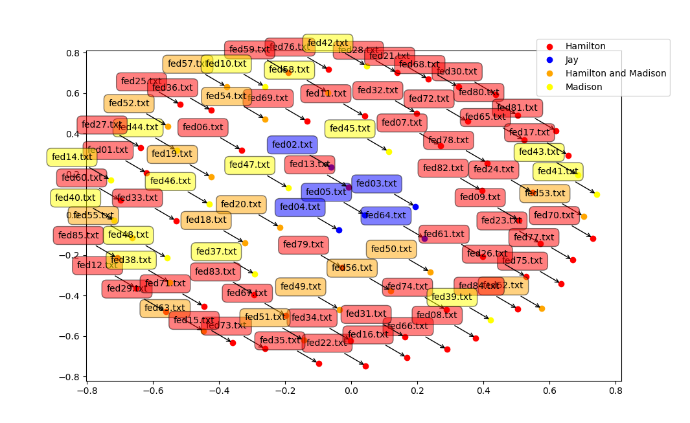

## downloadTheFederalistPapers.sh
Download The Federalist Papers to local folder and
also create a list of the papers written by Madison, Jay and Hamilton.

### script usage 

~~~ bash
$ ./downloadTheFederalistPapers.sh
~~~

### usage examples

~~~ bash
$ ./downloadTheFederalistPapers.sh 
$ cat *.txt | ./wordcounttfl.sh -w > vocabulary
$ head -n 2000 vocabulary > vocabularytop2000
$ python cosineexamplefederalist.py 
~~~

[back](./)

