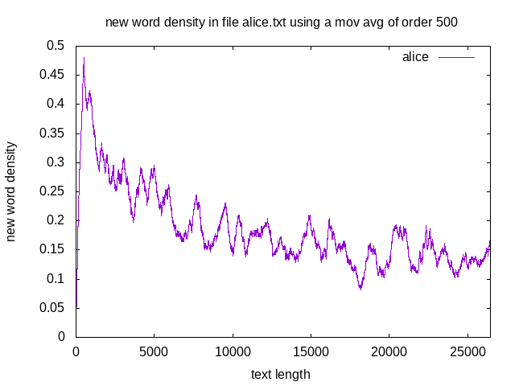

## simons.py  
Reads an input file or *stdin* and outputs a sequence of 0 and 1 
to designate an already used word or a new word, respectively. 
Alternatively it may outputs the average number of new words 
evolution or just the final rate of new words. 

It is based on the idea of Simon's stochastic models
which models the dynamic of a system based on the constant
growth via addition of new elements. This type of model
can result in a scale-free network, appropriate to capture 
Zipf's laws.

[Herbert A. Simon, On a Class of Skew Distribution Functions, Biometrika Vol. 42, No. 3-4, p. 425, 1955](https://www.jstor.org/stable/2333389)

### script usage 
Read the script help to see the available parameters.

~~~ bash
$ ./simons.py -h
usage: simons.py [-h] [-i FILE] [--newratio] [--newratioevo]

optional arguments:
  -h, --help     show this help message and exit
  -i FILE        input text file
  --newratio     show the ratio of new words in the data
  --newratioevo  show the ratio of new words evolution in the data
~~~

### usage examples

~~~ bash
$ cat alice.txt | ./simons.py | head -n 200 | tail -n 10
0
0
0
0
1
1
0
1
0
0

$ cat alice.txt | ./simons.py --newratio
0.186963590306

$ ./simons.py -i alice.txt --newratioevo | head -n 100 | tail -n 10
0.758241758242
0.75
0.752688172043
0.744680851064
0.747368421053
0.739583333333
0.742268041237
0.744897959184
0.737373737374
0.74
~~~

The results from this script might be used to plot the evolution of 
new word rate in a text. The example below show the results in the
novel *Alice's Adventures in Wonderland*.

~~~ bash
$ FILENAME='alice.txt'; MOVAVGORDER=500; WTOTAL=$(wc -w "$FILENAME" | awk '{print $1}'); cat $FILENAME | ./simons.py | ./movavg.awk -v P=$MOVAVGORDER | gnuplot -e "set terminal png; set output 'newworddensity.png'; set xlabel 'text length'; set ylabel 'new word density'; set xrange[0:$WTOTAL]; set title 'new word density in file $FILENAME using a mov avg of order $MOVAVGORDER'; set key right top; plot '/dev/stdin' with lines title 'alice'"; display newworddensity.png 
~~~

[back](./)

