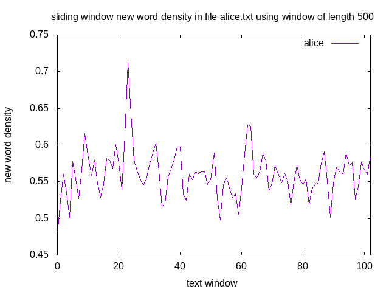

## swnwdensity.py
Sliding window new word density (uses half window overlap).

### script usage 
Use the **-h** option to the script help.

~~~ bash
$ ./swnwdensity.sh -h
Usage: ./swnwdensity.sh [option...] 

   -h, --help                 Display this help message
   -i, --input-file           Specify input file name
   -l, --window-length        Window length (number of words)
~~~

### usage examples

~~~ bahs
$ FILENAME='alice.txt'; WLEN=500; WTOTAL=$(wc -w "$FILENAME" | awk '{print $1}'); MAXLEN=$((WTOTAL - WLEN)); XMAX=$(echo 2*$MAXLEN/$WLEN-1 | bc); ./swnwdensity.sh -i $FILENAME -l $WLEN | gnuplot -e "set terminal png; set output 'swnewworddensity.png'; set xlabel 'text length'; set ylabel 'new word density'; set xrange[0:$XMAX]; set title 'sliding window new word density in file $FILENAME using window of length $WLEN'; set key right top; plot '/dev/stdin' with lines title 'alice'"; display swnewworddensity.png 
~~~ 

[back](./)

