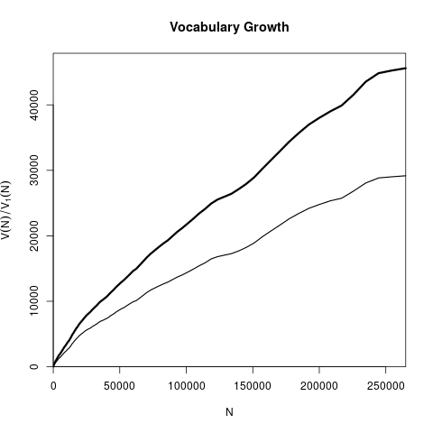
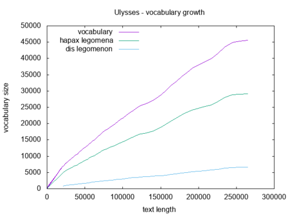

## vgc.py 
Create vocabulary growth curve data, compatible with **zipfR** package. 
Like **heaps.py**, it provides the first column with text length, 
the second with vocabulary size and subsequent columns display 
the number of types appearing from 1 to N times, 
where N is given by using the **-V** parameter.

## script usage

Help shows the usage syntax and available parameters.

~~~ bash
$ ./vgc.py --help
usage: vgc.py [-h] [-m MAXLEN] [-s SAMPLES] [-l] [-i FILE] [-V LEGOMENON] [-c]

optional arguments:
  -h, --help            show this help message and exit
  -m MAXLEN, --maxlen MAXLEN
                        Maximum length of the sample that will be analyzed.
  -s SAMPLES, --samples SAMPLES
                        Number of points in the output (linearly spaced or
                        logarithmically spaced). Use Inf or All to print every
                        single sample.
  -l, --log             Use logarithmic spaced samples.
  -i FILE, --input FILE
                        Input text file name.
  -V LEGOMENON, --legomenon LEGOMENON
                        Number of types in the corresponding frequency classes
                        at the specified Ns (-V 1: hapax legomena, -V 2: hapax
                        and dis legomenon, -V 3: hapax, dis and tris
                        legomenon, etc).
  -c, --counts          Print only counts (remove header)
~~~

### usage examples
For the basic usage, just provide the text file as input.
The example below present the first and last 5 lines of the result.

~~~ bash
$ ./vgc.py -i ulysses.txt | (head -5; echo "..."; tail -5) 
N	V 	V1 
1	1 	1 
2	2 	2 
3	3 	3 
4	4 	4 
...
265062	45457 	29036 
265063	45457 	29036 
265064	45457 	29036 
265065	45458 	29037 
265066	45459 	29038 
~~~

You can also read text from *stdin*, as illustrated in the 
example below.

~~~ bash
$ ./vgc.py --maxlen 10 -V 3 < ulysses.txt
N	V 	V1 	V2 	V3 
1	1 	1 	0 	0 
2	2 	2 	0 	0 
3	3 	3 	0 	0 
4	4 	4 	0 	0 
5	5 	5 	0 	0 
6	6 	6 	0 	0 
7	7 	7 	0 	0 
8	8 	8 	0 	0 
9	9 	9 	0 	0 
10	9 	8 	1 	0 
~~~

The result might be saved into a file and plotted. 
The example below uses **R** to plot the vocabulary growth in *Ulysses* by James Joyce.

~~~ bash
$ ./vgc.py -i ulysses.txt --samples 256 --log -V 3 > ulysses.vgc
$ R
> uvgc = read.vgc('ulysses.vgc')
> png('ulysses_vgc.png')
> plot(uvgc, add.m=1)
> dev.off()
~~~

Or it might be done directly in shell using **gnuplot**:
~~~ bash
$ ./vgc.py -i ulysses.txt --samples 256 --log -V 3 -c | 
  awk -- '{print $0} END{print "e"}' | 
  tee -i -a /dev/stdout /dev/stdout | 
  gnuplot -e "set terminal png; set output 'ulysses_vgc2.png'; set xlabel 'text length'; set ylabel 'vocabulary size'; set title 'Ulysses - vocabulary growth'; set key left top; plot '-' using 1:2 with lines title 'vocabulary', '-' using 1:3 with lines title 'hapax legomena', '-' using 1:4 with lines title 'dis legomenon'"
~~~

**awk** was used just to add an *e* to the end. 
**tee** was used to replicate the *stdout* since **gnuplot** needs one data for each line.

[back](./)
