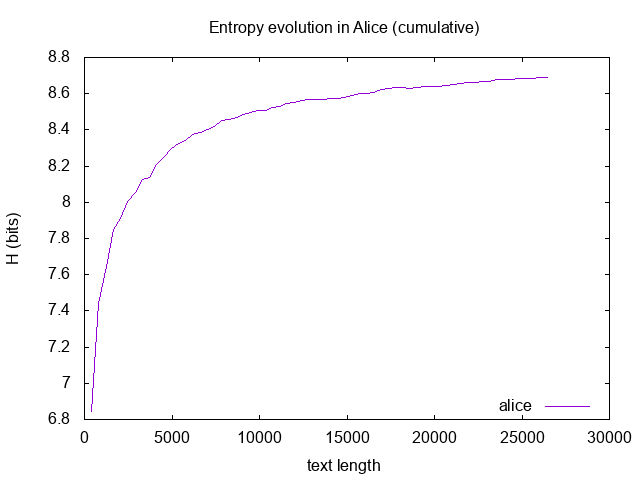
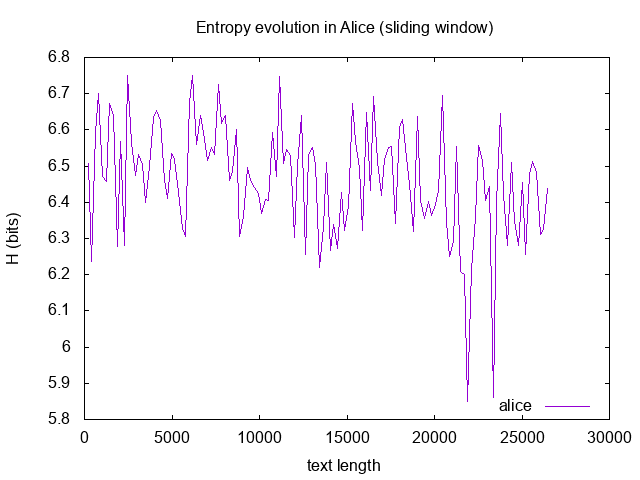
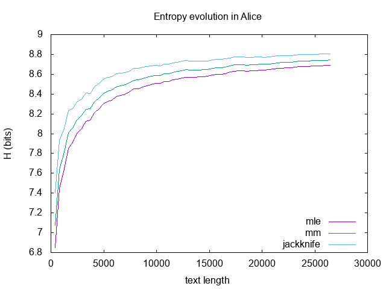
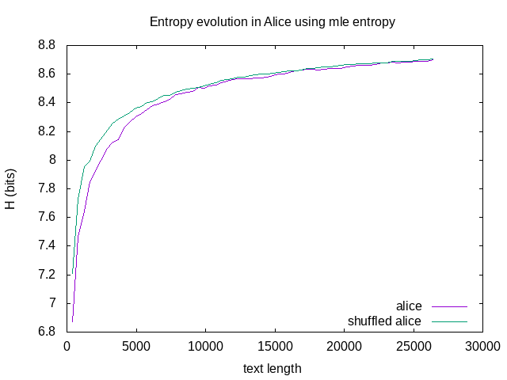

## windowentropy.sh
Compute the entropy along windows of a text file. 
You must provide the number of desided windows. 
It will slice the text into windows and compute 
the entropy inside each window. 
The text length might be linearly (fixed window length) 
or logarithmically (logarithmically growing window length) 
subdivided into windows. 
The text is subdivided into windows by counting the number of tokens 
(line, word or character).

This script uses [windowindex.py](./windowindex.html) (define window boundaries), 
[getwindow.sh](./getwindow.html) (extract text according to the boundaries given), 
[wordcounttfl.sh](./wordcounttfl.html) (count words) and 
[entropy.py](./entropy.html) (compute entropy).

### script usage 
The script help shows the available arguments and parameters for this script.

~~~ bash
$ ./windowentropy.sh -h
Usage: ./windowentropy.sh [option...] 

   -h, --help                 Display this help message
   -i, --input-file           Specify input file name
   -n, --num-windows          Specify the number of windows desired
   -s, --scale-windows        Specify whether windows length are linearly ('linear') or logarithmically ('log') scaled
   -c, --cum-window           Specify whether to use sliding windows or cumulative windows
   -t, --token                Specify token ('char', 'word', 'line')
   -m, --method               Choose the method to compute entropy ('mle','plugin','jk','jackknife','mm' or 'millermadow')
~~~

### usage examples
Some usage examples are presented below.

~~~ bash
$ ./windowentropy.sh -i alice.txt -n 64 -s linear -c cumulative -t word -m mle | gnuplot -e "set terminal png; set output 'images/windowentropy-alice.png'; set xlabel 'text length'; set ylabel 'H (bits)'; set title 'Entropy evolution in Alice'; set key right bottom; plot '-' using 2:3 with lines title 'alice'" && display images/windowentropy-alice.png
~~~

~~~ bash
./windowentropy.sh -i alice.txt -n 128 -s linear -c sliding -t word | gnuplot -e "set terminal png; set output 'windowentropy-alice-slidingwindow.png'; set xlabel 'text length'; set ylabel 'H (bits)'; set title 'Entropy evolution in Alice (sliding window)'; set key right bottom; plot '-' using 2:3 with lines title 'alice'" && display windowentropy-alice-slidingwindow.png
~~~

~~~ bash
$ ./windowentropy.sh -i data/alice.txt -n 64 -s linear -c cumulative -t word -m mle > /tmp/mle
$ ./windowentropy.sh -i data/alice.txt -n 64 -s linear -c cumulative -t word -m mm > /tmp/mm
$ ./windowentropy.sh -i data/alice.txt -n 64 -s linear -c cumulative -t word -m jackknife > /tmp/jackknife
$ paste /tmp/mle /tmp/mm /tmp/jackknife | awk -- '{print $0} END{print "e"}' | tee -i -a /dev/stdout /dev/stdout | gnuplot -e "set datafile separator whitespace; set terminal png; set output 'images/windowentropy-alice-compared.png'; set xlabel 'text length'; set ylabel 'H (bits)'; set title 'Entropy evolution in Alice'; set key right bottom; plot '-' using 2:3 with lines title 'mle', '-' using 2:6 with lines title 'mm', '-' using 2:9 with lines title 'jackknife'" && display images/windowentropy-alice-compared.png
~~~

Bellow is presented an example comparing the entropy evolution with the text length in the original text and a shuffled version of the text.
~~~ bash
$ cat Alice.txt | tr "A-Z" "a-z" | tr "’" "'" | tr -s "'" | tr -dc "a-z '\n" | tr -s "\n" > alice.txt
$ cat alice.txt | tr " " "\n" | tr -s "\n" | shuf > alice_shuffled.txt
$ ./windowentropy.sh -i alice_shuffled.txt -n 64 -s linear -c cumulative -t word -m mle > alice_hs
$ ./windowentropy.sh -i alice.txt -n 64 -s linear -c cumulative -t word -m mle > alice_h
$ paste alice_h alice_hs | awk -- '{print $0} END{print "e"}' | tee -i -a /dev/stdout /dev/stdout |
gnuplot -e "set terminal png; set output 'windowentropy-alice-shuffled.png'; set xlabel 'text length'; set ylabel 'H (bits)'; set title 'Entropy evolution in Alice using mle entropy'; set key right bottom; plot '-' using 2:3 with lines title 'alice', '-' using 5:6 with lines title 'shuffled alice'"
$ display windowentropy-alice-shuffled.png
~~~

[back](./)

