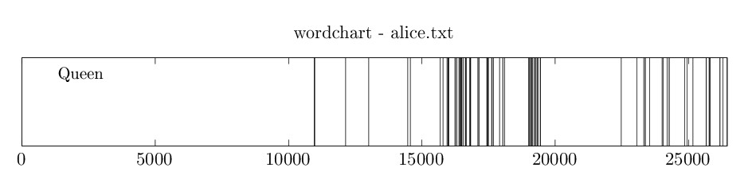
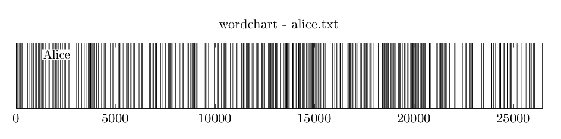
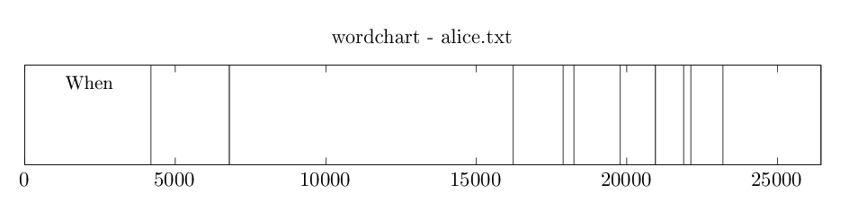
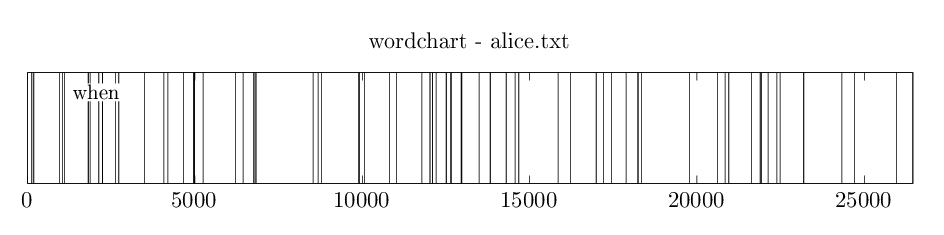

## wordchart.sh
Create a word chart, presenting each occurrence of 
a word along a text as a vertical bar.
 
### script usage 
Call for help to see the available script arguments.

~~~ bash
$ ./wordchart.sh -h
Usage: ./wordchart.sh [option...] 

   -h, --help                 Display this help message
   -o, --output-file          Specify output file name
   -i, --input-file           Specify input file name
   -w, --word		      Word to search for
   -c, --ignore-case          Ignore case
~~~

### usage examples
Below it is presented the location of the words 
**Queen**, **Alice** and **When** 
(comparing case sensitive and case insensite) in 
Lewis Carroll's novel, *Alice's Adventures in Wonderland*.

~~~bash
$ ./wordchart.sh -i alice.txt -w Queen -o alice-queen.tex; pdflatex alice-queen.tex; convert -flatten -density 150 alice-queen.pdf -quality 90 alice-queen.png; evince alice-queen.pdf &

$ ./wordchart.sh -i alice.txt -w Alice -o alice-alice.tex; pdflatex alice-alice.tex; convert -flatten -density 150 alice-alice.pdf -quality 90 alice-alice.png; evince alice-alice.pdf &

$ ./wordchart.sh -i alice.txt -w When -o alice-when.tex -c; pdflatex alice-when.tex; convert -flatten -density 150 alice-when.pdf -quality 90 alice-when.png; evince alice-when.pdf & 
~~~

[back](./)

