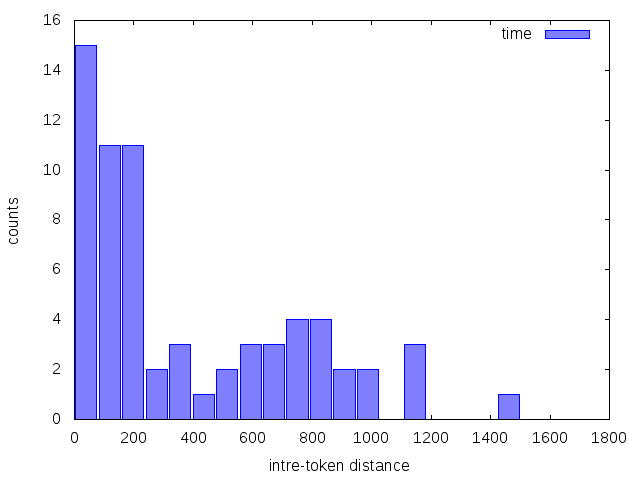
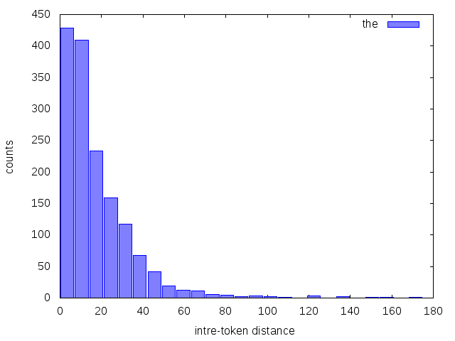

## wordposition.sh
Get word locations in a given text file. The default behaviour is 
to show the word count position. It is also possible (and faster) 
to show the byte (char) position.

### script usage 
Use the script help to see the syntax and arguments.

~~~ bash
$ ./wordposition.sh -h
Usage: ./wordposition.sh [option...] 

   -h, --help                 Display this help message
   -o, --output-file          Specify output file name
   -i, --input-file           Specify input file name
   -b, --byte			Use byte count to get a word position
   -w, --word			Word to search for
   -c, --ignore-case		Ignore case
~~~

### usage examples
We present bellow the location of the word **clock** in *Alice's Adventures in Wonderland*:

~~~ bash
$ ./wordposition.sh -i alice.txt -w clock 
14053
14334
14342
14363
14608
$ ./wordposition.sh -i alice.txt -w clock -b
79663
81407
81453
81569
83127
~~~

### inter-token distance ###
The difference between consecutive lines in the previous result 
might be used to create a inter-token distance vector. 

~~~ bash
$ WORD='the'; ./wordposition.sh -i data/alice.txt -w $WORD | awk 'NR>1{print $1-p} {p=$1}'
~~~

The result is further redirected to create a histogram of inter-token distance for a given word. We present two examples below, for the words: *time* and *the*.

~~~ bash 
$ WORD='time'; ./wordposition.sh -i data/alice.txt -w $WORD | awk 'NR>1{print $1-p} {p=$1}' | sort -n | gnuplot -p -e "numbins='25'; maxvalue='2000'; minvalue='1'; lbllegend='$WORD'; lblxlabel='intre-token distance'; lblylabel='counts'; outputfilename='$WORD-intertokenhist.png'" histogram.gp; display $WORD-intertokenhist.png
~~~

~~~ bash
$ WORD='the'; ./wordposition.sh -i data/alice.txt -w $WORD | awk 'NR>1{print $1-p} {p=$1}' | sort -n | gnuplot -p -e "numbins='25'; maxvalue='200'; minvalue='1'; lbllegend='$WORD'; lblxlabel='intre-token distance'; lblylabel='counts'; outputfilename='$WORD-intertokenhist.png'" histogram.gp; display $WORD-intertokenhist.png
~~~

[back](./)

