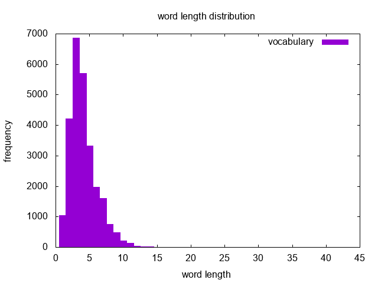

## wordslengthdist.sh 
Estimate the distribution of word length from a text file (or from *stdin*) 
and output a list of frequency and word lengths.

### script usage 
The script's help provides the available parameters to use with.

~~~ bash
$ ./wordslengthdist.sh -h
Usage: ./wordslengthdist.sh [option...] 

   -h, --help                 Display this help message
   -o, --output-file          Specify output file name
   -i, --input-file           Specify input file name
~~~

### usage examples
We estimate bellow the word length distribution in *Alice's Adventures in Wonderland*:

~~~ bash
$ ./wordslengthdist.sh alice.txt 
$ ./wordslengthdist.sh -i alice.txt
$ ./wordslengthdist.sh --input-file alice.txt
$ cat alice.txt | ./wordslengthdist.sh 
~~~

We might use the result from **wordslengthdist.sh** and **gnuplot**
to plot the histogram of words length. Once again *Alice* is used in the example.

~~~ bash 
cat alice.txt | ./wordslengthdist.sh | gnuplot -e "set terminal png; set output 'alice-wlen-freq.png'; set xlabel 'word length'; set ylabel 'frequency'; set title 'word length distribution'; set key right top; set style fill solid; set yrange [0:]; set boxwidth 1; plot '-' using 2:1 with boxes title 'vocabulary'"
~~~

[back](./)
